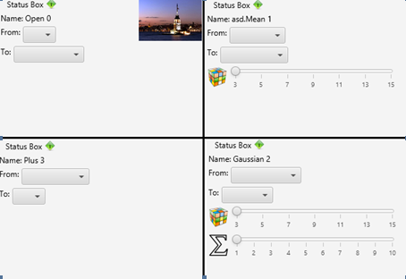
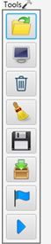
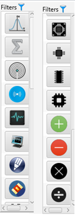

Nowadays engineers and workers usually use more than one filters in image processing project.In this project we provide a visual design environment for this workers and engineers using javaFx.

Now If I talk about user interface ,the user interface components are :
    
 1.STATUSBOX:
         -Status box is a box that provides informations about filter that is used.
            
   
 2.TOOLBOX:
         -Tool box is a box that provides all tools that are used to design. 
         
         
         
  
 
 
 
  3.FILTERBOX:
         -Filter box is a box that provides all filters and operators that are used to design. 
         
         
         
         
 

