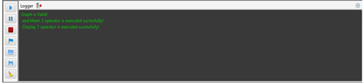
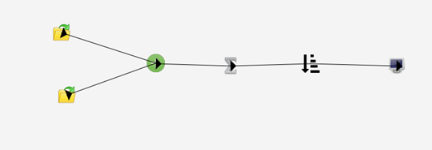

Nowadays engineers and workers usually use more than one filters in image processing project.In this project we provide a visual design environment for this workers and engineers using javaFx.

Now If I talk about user interface ,the user interface components are :
    
 1.STATUSBOX:
         -Status box is a box that provides informations about filter that is used.
            
   
 2.TOOLBOX:
         -Tool box is a box that provides all tools that are used to design. 
         
         
         
  
 
 
 
  3.FILTERBOX:
         -Filter box is a box that provides all filters and operators that are used to design. 
         
         
         
         
 
 
 
 
 4.LOGGERSCREEN:
        -This is a screen that provides bugs and information about design.
        
 

 5.MENU:
         -Menu for user.
        

 6.SAMPLE DESIGN:
 
 
 
 Technologies Are Used:
 
     -Intellij idea
     -JavaFx
     -Java(Version 8 Update 71)
     
 Filters Are Implemented:    
    
     -Highpass Filter
     -Lowpass Filter
     -Bandreject Filter
     -Bandpass Filter
     -Gaussian Filter
     -Median Filter
     -Mean Filter
     -Sobel Filter
     -Prewitt Filter
     -Laplace Filter
     -Sharping Filter

Operators Are Implemented:    
    
     -AND Operator
     -OR Operator
     -XOR Operator
     -NOT Operator
     -SUM Operator
     -SUB OPERATOR
     -MULTIPLICATION Operator
     -DIVISION Operator
     
     
 Also This program provides debug running mode:
 
 
     

